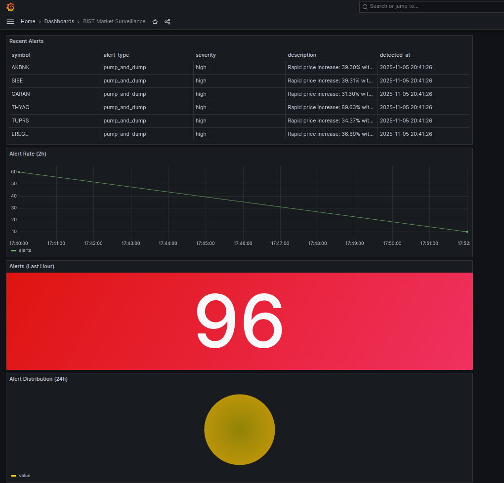

# BIST Real-Time Market Surveillance Platform

Real-time market surveillance and anomaly detection platform for Borsa Istanbul (BIST).

Türkiye Borsası İstanbul (BIST) için gerçek zamanlı piyasa gözetim ve anomali tespit platformu.

## Project Purpose / Proje Amacı

Addresses critical needs for financial infrastructure institutions like TakasBank and MKK:
- Real-time trade monitoring with stream processing
- Market manipulation detection (pump-and-dump, wash trading, spoofing, price manipulation)
- Risk analysis and early warning system
- RESTful API for alert and trade queries

TakasBank ve MKK gibi finansal altyapı kurumlarının kritik ihtiyaçlarına yanıt verir:
- Stream processing ile gerçek zamanlı işlem izleme
- Piyasa manipülasyonu tespiti (pump-and-dump, wash trading, spoofing, fiyat manipülasyonu)
- Risk analizi ve erken uyarı sistemi
- Alert ve trade sorguları için RESTful API

## Features / Özellikler

- Real-time data ingestion from Yahoo Finance / Yahoo Finance'ten gerçek zamanlı veri çekme
- Apache Kafka for event streaming / Event streaming için Apache Kafka
- Spark Structured Streaming for real-time processing / Gerçek zamanlı işleme için Spark Structured Streaming
- Windowed aggregations (1-minute intervals) / Pencereli agregasyonlar (1 dakikalık aralıklar)
- Rule-based anomaly detection / Kural tabanlı anomali tespiti
- Dual storage (Elasticsearch + PostgreSQL) / Çift depolama (Elasticsearch + PostgreSQL)
- RESTful API with FastAPI / FastAPI ile RESTful API
- Ready for Grafana dashboards / Grafana dashboard'lar için hazır
- LSTM Autoencoder for time-series anomaly detection / Zaman serisi anomali tespiti için LSTM Autoencoder
- Trained on 30 days historical data / 30 günlük historical veri ile eğitilmiş

## Technology Stack / Teknoloji Stack

- **Streaming:** Apache Kafka 3.6
- **Processing:** Apache Spark 3.5 (Structured Streaming)
- **Storage:** Elasticsearch 8.11, PostgreSQL 15, Redis 7.2
- **Visualization:** Grafana 10.2 (ready)
- **ML:** TensorFlow 2.15, Scikit-Learn 1.3 (ready)
- **API:** FastAPI 0.104
- **Orchestration:** Apache Airflow (ready)
- **Language:** Python 3.11

## Architecture / Mimari
```
┌─────────────────────────────────────────────────────────────────┐
│                    DATA SOURCES (Yahoo Finance)                  │
└────────────────────────┬────────────────────────────────────────┘
                         │
                         ▼
┌─────────────────────────────────────────────────────────────────┐
│                 KAFKA TOPICS (Event Streaming)                   │
│  • bist.trades.raw     • bist.trades.enriched  • bist.alerts    │
└────────────────────────┬────────────────────────────────────────┘
                         │
                         ▼
┌─────────────────────────────────────────────────────────────────┐
│            SPARK STRUCTURED STREAMING (Processing)               │
│  • Windowed Aggregations  • Anomaly Detection  • Enrichment     │
└────────────────────────┬────────────────────────────────────────┘
                         │
                         ▼
┌─────────────────────────────────────────────────────────────────┐
│                    STORAGE LAYER                                 │
│  • Elasticsearch (alerts + trades)  • PostgreSQL (metadata)     │
└────────────────────────┬────────────────────────────────────────┘
                         │
                         ▼
┌─────────────────────────────────────────────────────────────────┐
│                  API & VISUALIZATION                             │
│  • FastAPI (REST)  • Grafana Dashboards (ready)                 │
└─────────────────────────────────────────────────────────────────┘
```

## Dashboard / Gösterge Paneli



Real-time monitoring dashboard showing:
- Alert statistics and distribution
- Recent alerts table
- Alert rate timeline
- Total alert counter with threshold-based coloring

Gerçek zamanlı izleme gösterge paneli:
- Alert istatistikleri ve dağılımı
- Son alert'ler tablosu
- Alert rate zaman çizelgesi
- Eşik değer bazlı renkli toplam alert sayacı

## Anomaly Detection Rules / Anomali Tespit Kuralları

1. **Pump and Dump**: Price increase >15% with high volume / Fiyat artışı %15+ yüksek hacimle
2. **Wash Trading**: High volume with minimal price change / Yüksek hacim, minimal fiyat değişimi
3. **Volume Spike**: Unusual volume exceeding threshold / Eşik değerini aşan olağandışı hacim
4. **Price Manipulation**: Sharp price decline >15% / Keskin fiyat düşüşü %15+

## Quick Start / Hızlı Başlangıç

### Requirements / Gereksinimler
- Docker and Docker Compose
- Python 3.11+
- Ubuntu 20.04+ (recommended / önerilir)
- 8GB RAM minimum

### Installation / Kurulum

1. Clone the repository / Repository'yi klonlayın:
```bash
git clone https://github.com/umitbora55/bist-market-surveillance.git
cd bist-market-surveillance
```

2. Start infrastructure / Altyapıyı başlatın:
```bash
docker-compose up -d
```

3. Setup Python environment / Python ortamını kurun:
```bash
python3.11 -m venv venv
source venv/bin/activate
pip install -r requirements.txt
```

4. Create Kafka topics / Kafka topic'lerini oluşturun:
```bash
./scripts/setup_kafka_topics.sh
```

5. Create Elasticsearch indices / Elasticsearch index'lerini oluşturun:
```bash
./scripts/setup_elasticsearch_indices.sh
```

### Running the System / Sistemi Çalıştırma

**Terminal 1: Data Producer**
```bash
python src/kafka_producers/trade_producer.py --mode stream --rate 15
```

**Terminal 2: Spark Streaming Pipeline**
```bash
python src/spark_streaming/full_pipeline.py
```

**Terminal 3: Alert Consumer**
```bash
python src/spark_streaming/alert_consumer.py
```

**Terminal 4: REST API**
```bash
python src/api/main.py
```

### API Endpoints

- `GET /health` - Health check
- `GET /alerts` - Get recent alerts (query params: symbol, alert_type, severity, limit)
- `GET /alerts/stats` - Alert statistics
- `GET /alerts/{alert_id}` - Get specific alert
- `GET /trades` - Get recent trades (query params: symbol, limit)
- `GET /stocks` - List all stocks
- `GET /stocks/{symbol}` - Get specific stock

API Documentation: http://localhost:8000/docs

### Monitoring

- Grafana: http://localhost:3000 (admin/admin)
- Elasticsearch: http://localhost:9200
- API: http://localhost:8000

## Project Status / Proje Durumu

Sprint 1 (Foundation) - COMPLETED / TAMAMLANDI 
- Infrastructure setup
- Data ingestion pipeline
- Real-time stream processing
- Anomaly detection
- Storage layer
- REST API

Sprint 2 (Visualization & API) - COMPLETED / TAMAMLANDI
 
Sprint 3 (ML Models) - COMPLETED / TAMAMLANDI 
- LSTM Autoencoder trained and integrated
- Anomaly detection threshold: 1.22
- Detection rate: 1.22% on training data

Sprint 4 (Planned) - Airflow Orchestration

## Performance / Performans

- Processing rate: 15+ trades/second / İşleme hızı: saniyede 15+ işlem
- Alert detection latency: <2 seconds / Alert tespit gecikmesi: <2 saniye
- Windowed aggregation: 1-minute intervals / Pencereli agregasyon: 1 dakikalık aralıklar
- Tested with: 1500+ trades, 63 alerts / Test edilen: 1500+ işlem, 63 alert

## Data Sources / Veri Kaynakları

Real-time market data from Yahoo Finance API for 10 BIST stocks:
- THYAO (Turkish Airlines)
- GARAN (Garanti BBVA)
- AKBNK (Akbank)
- ISCTR (Is Bankasi)
- SISE (Sise Cam)
- TUPRS (Tupras)
- EREGL (Erdemir)
- SAHOL (Sabanci Holding)
- PETKM (Petkim)
- KCHOL (Koc Holding)

## License / Lisans
MIT License

## Contact / İletişim
Ümit Bora Günaydın - [LinkedIn](https://www.linkedin.com/in/ümit-bora-günaydın)

